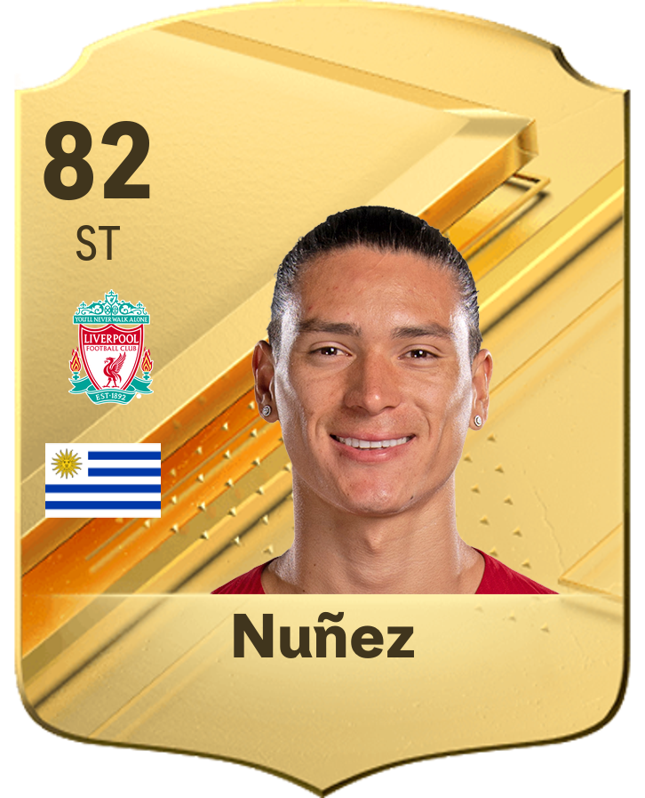
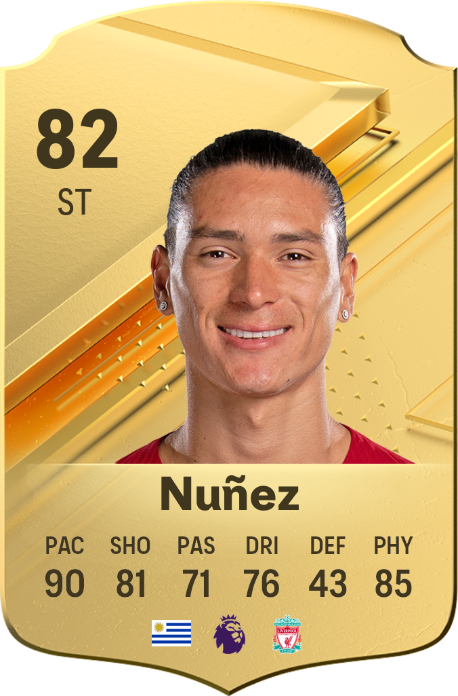

# UTCardMakr

- [UTCardMakr](#utcardmakr)
  - [Installation](#installation)
  - [Examples](#examples)
  - [Usage](#usage)

## Installation

```sh
pip install git+https://github.com/anasouh/utcardmakr
```

## Examples

| Small                                               | Large                                               |
|-----------------------------------------------------|-----------------------------------------------------|
|  |  |


## Usage

```py
from utcardmakr import SmallCard, Rarity, Color, LargeCard

img = SmallCard.create(
    rarity=Rarity.RARE,
    color=Color.GOLD, 
    face_fp="player/face/path", # Put a transparent image for a better result
    overall="84", 
    position="RB", 
    name="Hakimi", 
    club_fp="club/logo/path", # Put a transparent image for a better result
    country_fp="flag/icon/path" # Put a transparent image for a better result
)

# Show the result
img.show()

# Save the result
img.save("card.png")

img = LargeCard.create(
    rarity=Rarity.RARE,
    color=Color.GOLD, 
    face_fp="player/face/path", # Put a transparent image for a better result
    overall="84",
    position="RB", 
    name="Hakimi", 
    club_fp="club/logo/path", # Put a transparent image for a better result
    league_fp="league/logo/path", # Put a transparent image for a better result
    country_fp="flag/icon/path", # Put a transparent image for a better result
    attributes=("90", "81", "71", "76", "43", "85") # PAC, SHO, PAS, DRI, DEF, PHY
)

```
